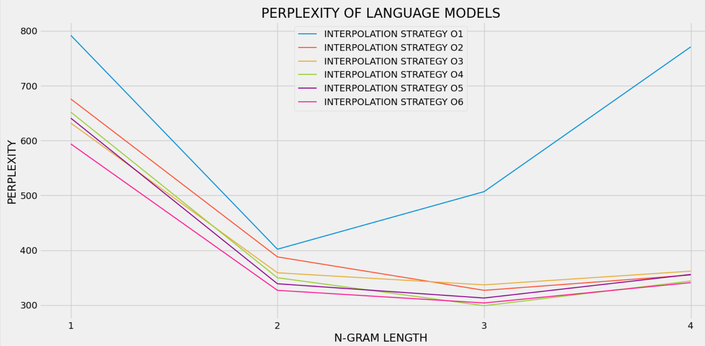
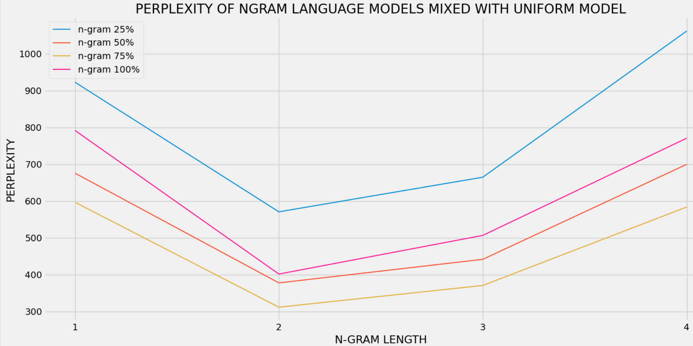

## ABOUT
A language model is a probability distribution over sequences of words. Given such a sequence, it assigns a probability to the whole sequence. The language model provides context to distinguish between words and phrases that sound similar. Predicting the probability of a word in a sentence is a fundamental task in natural language processing. It is used in many NLP applications such as autocomplete, spelling correction, or text generation. Language models can be used to predict a word in a sentence based on surrounding words. They can also be used to correct a real-word or non-word error in a query by suggesting the best possible replacement based on the context.

## CONTENTS
  ### TEXT GENERATION (TEXT_GENERATOR.py) 
It takes some incomplete text/query from the user and then completes that query based on a language model that the user chooses. In the entire project, mainly 4 language models are used (unigram, bigram, trigram, quadgram). The meaningfulness of a complete sentence generated by the program depends on the model chosen. While a unigram model might simply concatenate the most common words together, an n-gram model of length greater than one will derive some context from the previous words in the sentence and accordingly choose the next word.
  ### INTERPOLATION OF SEVERAL MODELS (MODEL_INTERPOLATION.py)
As the length of the n-gram increases, the power or expressiveness of the model increases. But, the ability to estimate accurate parameters from sparse data might decrease. In this project, when a test corpus of 56,228 tokens was taken, the perplexity of a pure trigram model was observed to be worse/higher than that of bigram. The perplexity of a quadgram model was also higher than that of trigram (bigram: 402, trigram: 507, quadgram:771). Trigram model and up are much worse than bigram or unigram models largely due to the high number of trigrams and quadgrams that appear in the evaluation texts but nowhere in the training text. Hence, their predicted probability is zero and smoothed probability becomes negligible. 

For most n-gram models, their performance is slightly improved when we interpolate their predicted probabilities with the uniform model along with other n-gram models with lesser length. In this part, each of the five models (including the uniform model) is given some interpolation weight between zero and unity such that all the weights add-up to one. The interpolated model is then evaluated by computing its perplexity for the test corpus. Several interpolation strategies were used and tested using this application and the following observations were made. 

*The pure uniform model is not shown in the plot due to its high perplexity of 3939. 
In this project as a convention for the interpolated models, an interpolated n-gram model is a model having non-zero weight for the n-gram model and zero weight for all m-gram models with m>n.*

<ul>
  <li> INTERPOLATION STRATEGY O1 : In this case, pure n-gram models were used without any mixing with other models. As discussed, the variation in perplexity was not observed to be monotonically decreasing as one might expect it to. 
    <!--&nbsp;&nbsp;[ 1 0 0 0 0 ] [ 0 1 0 0 0 ] [ 0 0 1 0 0 ] [ 0 0 0 1 0 ] [ 0 0 0 0 1 ]-->
  <li> INTERPOLATION STRATEGY O2 : In this case, the total weight was equally distributed among all the n-grams. 
    <!--&nbsp;&nbsp;[ 1 0 0 0 0 ] [ 0.5 0.5 0 0 0 ] [ 0.33 0.33 0.33 0 0 ] [ 0.25 0.25 0.25 0.25 0 ] [ 0.2 0.2 0.2 0.2 0.2 ]-->
  <li> INTERPOLATION STRATEGY O3 : In this case, some weight is given to the uniform model (less than others) and the rest of the weight is equally distributed among the others. 
    <!--&nbsp;&nbsp;[ 1 0 0 0 0 ] [ 0.4 0.6 0 0 0 ] [ 0.2 0.4 0.4 0 0 ] [ 0.025 0.325 0.325 0.325 0 ] [ 0.04 0.24 0.24 0.24 0.24 ]-->
  <li> INTERPOLATION STRATEGY O4 : In this case, the models in the first strategy are ranked based on decreasing perplexity and then weights are distributed as an increasing A.P. 
    <!--&nbsp;&nbsp;[ 1 0 0 0 0 ] [ 0.45 0.55 0 0 0 ] [ 0.233 0.333 0.433 0 0 ] [ 0.1 0.2 0.4 0.3 0 ] [ 0.02 0.11 0.38 0.29 0.2 ]-->
  <li> INTERPOLATION STRATEGY O5 : In this case, the common difference of the A.P. in which the weights were distributed in the fourth strategy was increased. 
    <!--&nbsp;&nbsp;[ 1 0 0 0 0 ] [ 0.425 0.575 0 0 0 ] [ 0.1833 0.3333 0.4833 0 0 ] [ 0.025 0.175 0.475 0.325 0 ] [ 0.01 0.105 0.39 0.295 0.2 ]-->
  <li> INTERPOLATION STRATEGY O6 : In this case, the weights are proportional to the square of the rank alloted to the models based on their perplexities (like in strategy 4 and 5). 
    <!--&nbsp;&nbsp;[ 1 0 0 0 0 ] [ 0.2 0.8 0 0 0 ] [ 0.0714 0.2857 0.6428 0 0 ] [ 0.0333 0.1333 0.5333 0.3 0 ] [ 0.0182 0.0727 0.4545 0.2909 0.1636 ]-->
</ul>

**Open in raw format to know the values of the weights in each case.**
  
  ### OPTIMISED INTERPOLATION OF MODELS
  ### o MIXING N-GRAM MODELS WITH UNIFORM MODEL ONLY
  The perplexities of n-gram language models were studied upon mixing them with some proportion of uniform model (the naivest model in which each unigram has the same probability of occurence). It was observed that for all n-gram models (at least upto length 4), the performance is considerably improved their predicted probabilities are interpolated with the uniform model. Look at the performance of these models when mixed with the uniform model in different fractions.

